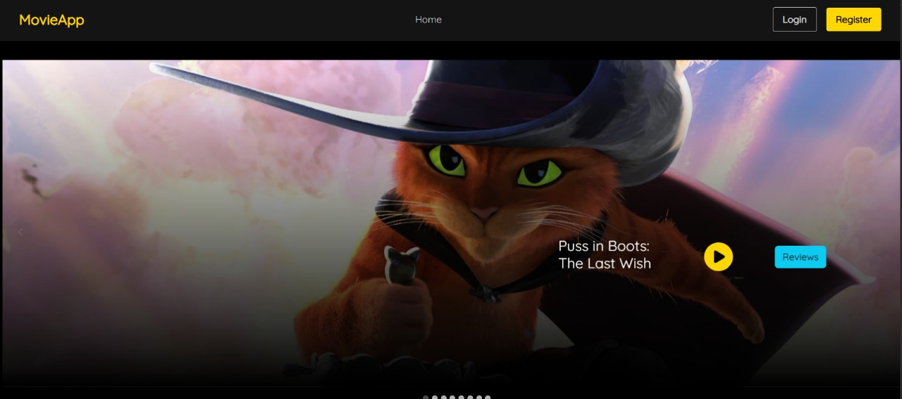
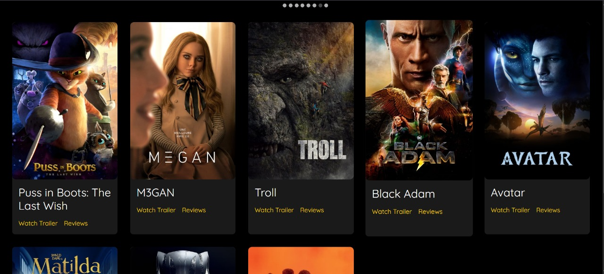
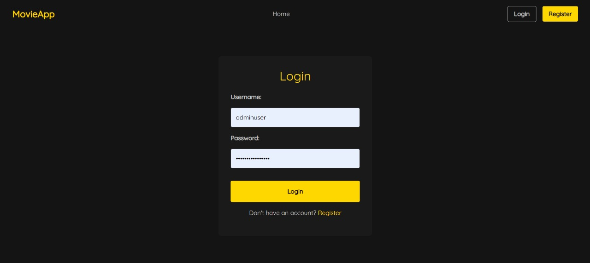
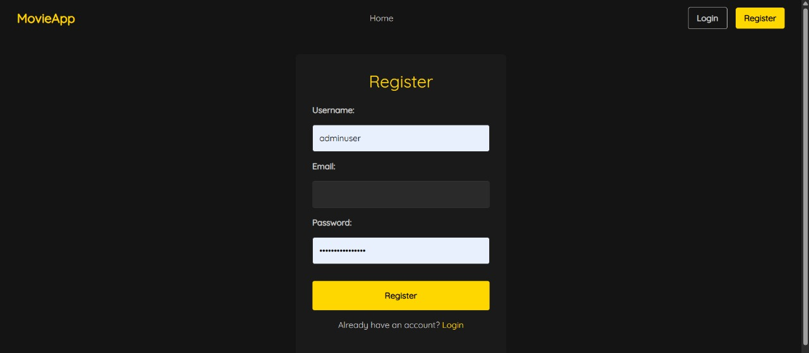
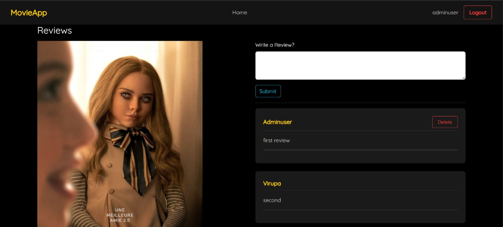
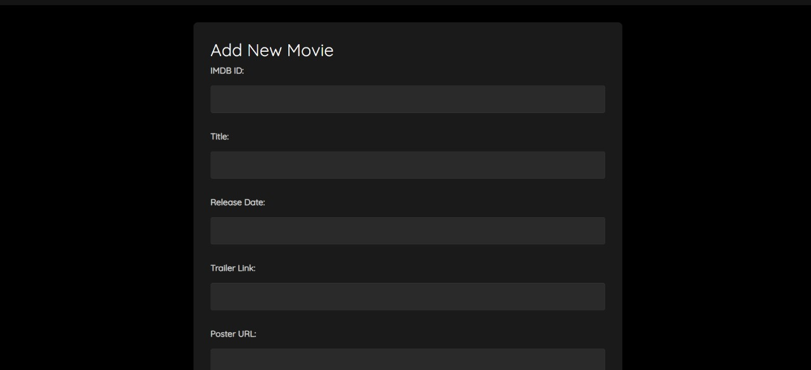

Here’s a clean, professional README for your **Cinema Critic System** project — excluding individual member contributions as you asked:

---

# 🎬 Movie-review-System

> A modern movie review and management platform built using **React** for the frontend and **Spring Boot** with **MongoDB** for the backend.

---

## 📜 Problem Statement

In today’s digital era, movie enthusiasts need a platform where they can **discover**, **review**, and **discuss** films seamlessly. Many existing systems fail to provide:
- Engaging user interaction
- Efficient movie content management
- Secure authentication
- A cohesive user and admin experience
- High-performance architecture using modern technologies

The Cinema Critic System addresses these issues by offering a **comprehensive**, **user-friendly**, and **secure** platform for both users and administrators.

---

## 🚀 Key Features

- ✨ **User Registration & Authentication**  
  Secure signup/login with role-based access control.

- 🎞️ **Movie Catalog**  
  Detailed listings including title, release date, posters, and trailer links.

- 📝 **Review System**  
  Authenticated users can submit and manage movie reviews.

- 🛠️ **Admin Features**  
  Administrators can add, update, and delete movie entries.

- 📱 **Responsive Design**  
  Modern, mobile-friendly user interface.

- 🔐 **Secure RESTful APIs**  
  JWT-based authentication with properly secured endpoints.

---

## 🛠️ System Architecture

### 📚 Architectural Patterns

- **Primary:** Layered Architecture
  - *Presentation Layer*: React components (e.g., `Home.jsx`, `Reviews.jsx`, `AddMovie.jsx`)
  - *Controller Layer*: Spring Boot controllers (e.g., `MovieController.java`, `ReviewController.java`)
  - *Service Layer*: Core business logic (e.g., `MovieService.java`, `ReviewService.java`)
  - *Repository Layer*: Database interaction (MongoDB via Spring Data)
  - *Domain Layer*: Entity models (e.g., `Movie.java`, `Review.java`, `User.java`)

- **Secondary:** Client-Server Architecture  
  A React frontend interacts with the Spring Boot backend over secure HTTP APIs.

- **MVC Pattern:**  
  - **Model**: Java entities and repositories  
  - **View**: React components  
  - **Controller**: RESTful API controllers

---

## 📏 Design Principles

The project follows **SOLID** design principles:
- **SRP:** Each class has a clear, singular responsibility.
- **OCP:** System components are open for extension but closed for modification.
- **LSP:** Subtypes can seamlessly replace base types without errors.
- **ISP:** Interfaces are client-specific, avoiding bloated contracts.
- **DIP:** High-level modules depend on abstractions, not concretions.

---

## 🧠 Design Patterns Used

- **Singleton Pattern:** Spring-managed beans like services and controllers ensure a single shared instance.
- **Adapter Pattern:** MongoDB repositories adapted through Spring Data interfaces.
- **Facade Pattern:** Service layer simplifies complex business operations.
- **Proxy Pattern:** Secure API access through JWT-based authentication mechanisms.

---

## 📸 UI Screenshots

### 🏠 Home Page

### 🏠 Home Page (Alternate)

### 🔑 Login Page

### 📝 Register Page

### 🧐 Review Page

### 🎬 Watch Trailer Page

### ➕ Add New Movie Page

---

## 💻 Tech Stack

| Frontend | Backend | Database | Authentication |
| :------: | :------: | :-------: | :-------------: |
| React.js | Spring Boot | MongoDB | JWT (JSON Web Token) |

---

## 📂 Repository

Source Code: [GitHub - Movie Review System](https://github.com/Gaonkar30/Movie-review-system.git)

---

## 📜 License

This project is licensed under the [MIT License](LICENSE).
